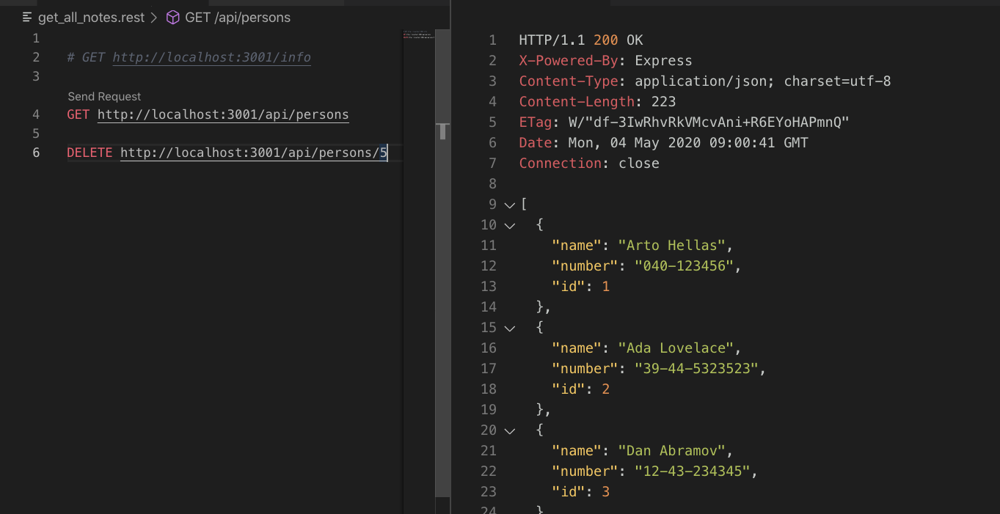

### part 3 of Full Stack Open

main FSO repo [here](https://github.com/Mrtly/FSO)

###### _Exercises 3.1-3.6_
- [x] Node.js & Express
- [x] Simple web server
- [x] Express, nodemon
- [x] REST
- [x] Fetching a single resource
- [x] Deleting resources
- [x] Postman
- [x] The Visual Studio Code REST client

- [x] About HTTP request types
- [x] body-parser Middleware : to parse incoming request bodies in a middleware before the handlers, available under the req.body property.
- [x] Receiving data

###### _Exercises 3.7-3.8_
- [x] Deploying app to internet
- [x] Saving data to MongoDB
- [x] Validation & ESLint

App deployed on [fso-test.herokuapp.com](https://fso-test.herokuapp.com/)
API on [fso-test.herokuapp.com/api/persons](https://fso-test.herokuapp.com/api/persons)

###### _reminder_
to run with nodemon
`node_modules/.bin/nodemon index.js` or `npm run dev`
